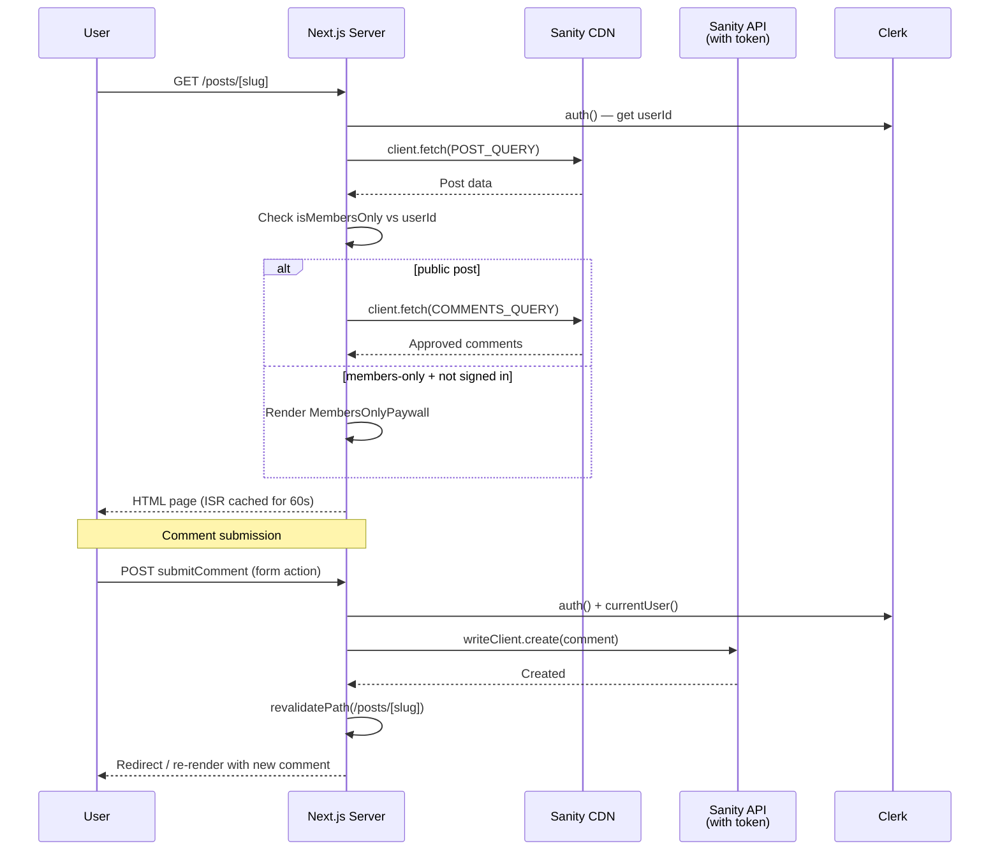
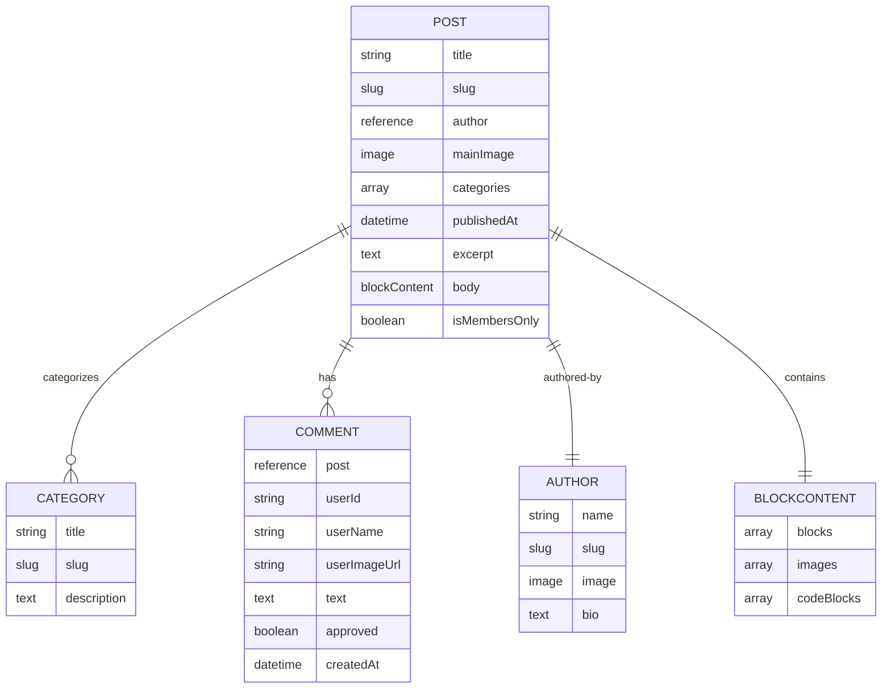
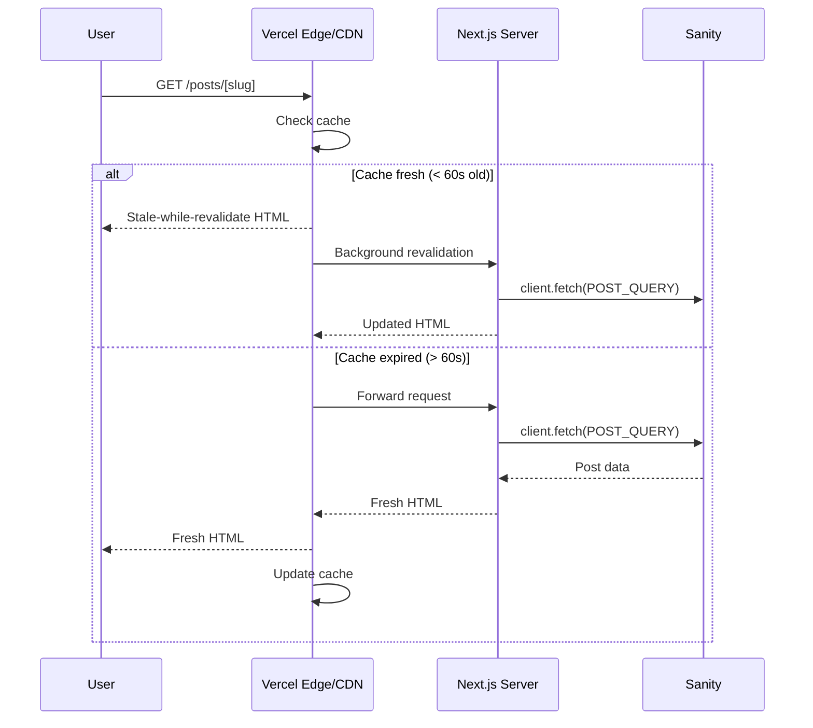

# Architecture

## Overview

GreyMatter Journal is a personal tech blog built on **Next.js 16** (App Router), **React 19**, **Sanity CMS v6**, **Clerk** for authentication, **Tailwind v4** for styling, and **TypeScript** (strict mode).

```mermaid
graph TB
    User((User)) --> Next[Next.js 16 App]
    Next --> Pages[Page Router<br/>(main) route group]
    Next --> Studio[Sanity Studio<br/>/studio route]
    Pages --> Root[Root Layout<br/>html, body, font]
    Root --> MainGroup["(main) Layout<br/>ClerkProvider, ThemeProvider"]
    MainGroup --> Header[Header<br/>Sanity categories + Auth]
    MainGroup --> Content[Page Content]
    MainGroup --> Footer[Footer]
    Content --> Sanity[Sanity CMS<br/>Read client - CDN]
    Content --> Clerk[Clerk Auth]
    Content --> Comments[Comments<br/>Write client - Token]
```

## Directory Structure

```
src/
├── app/
│   ├── (main)/              # Route group — public blog
│   │   ├── layout.tsx       # (main) — ClerkProvider, ThemeProvider, Header, Footer
│   │   ├── page.tsx         # Homepage
│   │   ├── authors/[slug]/  # Author profile
│   │   ├── categories/[slug]/ # Category listing
│   │   ├── posts/[slug]/    # Post detail + OG image
│   │   ├── sign-in/         # Clerk sign-in
│   │   └── sign-up/         # Clerk sign-up
│   ├── layout.tsx           # Root — html, body, Inter font, globals.css
├── actions/comments.ts  # Server action
│   ├── studio/              # Sanity Studio (separate layout)
│   ├── globals.css          # Tailwind v4
│   ├── sitemap.ts
│   └── robots.ts
├── components/
│   ├── Header.tsx           # Server: dynamic category nav
│   ├── HeaderAuth.tsx       # Client: Clerk buttons + theme toggle
│   ├── Footer.tsx
│   ├── PostCard.tsx
│   ├── Comments.tsx         # Server: comment list + form
│   ├── CodeBlock.tsx        # Client: Prism syntax highlighting
│   ├── PortableTextComponents.tsx  # Sanity block content renderers
│   ├── MembersOnlyPaywall.tsx
│   ├── ThemeProvider.tsx
│   └── ThemeToggle.tsx
├── sanity/
│   ├── lib/
│   │   ├── client.ts        # Read client (CDN in prod)
│   │   ├── writeClient.ts   # Write client (token-based)
│   │   ├── image.ts         # urlForImage helper
│   │   ├── queries.ts       # GROQ queries
│   │   └── types.ts         # TypeScript types
│   └── schemaTypes/         # 5 document schemas
└── proxy.ts                 # Clerk middleware
```

## Routing & Layouts

Layouts are split into two layers:

1. **`app/layout.tsx`** — root layout: `<html>`, `<body>`, `Inter` font, `globals.css` import. Required by Next.js as the outermost wrapper.
2. **`app/(main)/layout.tsx`** — route group layout: ClerkProvider, ThemeProvider, Header, Footer, `<main>` container.

Additionally `/studio` has its own route group (no Clerk, exported `force-static`).

```mermaid
flowchart LR
    subgraph App["Next.js App"]
        direction LR
        Root["app/layout.tsx<br/>(html, body, font, globals)"]
        
        subgraph Public["(main) Route Group"]
            direction TB
            ML["layout.tsx<br/>ClerkProvider, ThemeProvider,<br/>Header, Footer"] --> H[Home /]
            ML --> P[Post /posts/[slug]]
            ML --> A[Author /authors/[slug]]
            ML --> C[Category /categories/[slug]]
            ML --> SI[Sign In /sign-in]
            ML --> SU[Sign Up /sign-up]
        end

        subgraph Studio["Studio Route"]
            S[Sanity Studio<br/>/studio/[[...tool]]<br/>force-static]
        end
    end

    Root --> Public
    Root --> Studio
    ML -.-> |public routes| Clerk
    SI -.-> ClerkAuth[Clerk Modal]
    SU -.-> ClerkAuth
```

## Data Flow

All content pages are **server components** that fetch from Sanity at request time. ISR (`revalidate = 60`) caches pages for 60 seconds between regenerations.



## Auth Architecture

Auth middleware lives in `proxy.ts` (not `middleware.ts`). All blog-facing routes are public; non-listed routes are protected.

```mermaid
flowchart TD
    Request[HTTP Request] --> Match{Clerk Middleware<br/>config.matcher}
    Match -->|Static files<br/>_next, /studio| Skip[Skip middleware]
    Match -->|All other routes| MW[clerkMiddleware runs]
    MW --> Public{isPublicRoute?<br/>/, /posts/*, /categories/*<br/>/sign-in, /sign-up, /studio}
    Public -->|Yes| Allow[Allow - no auth check]
    Public -->|No| Protect[auth.protect()<br/>redirects to /sign-in]

    subgraph PostPage["Post Page Server Component"]
        A[auth()] --> ID{userId exists?}
        ID -->|Yes + post.isMembersOnly| Show[Show full content + comments]
        ID -->|No + post.isMembersOnly| Paywall[Show MembersOnlyPaywall]
        ID -->|post.isMembersOnly = false| Show
    end
```

## Sanity Schema

Five document types define all content in the CMS.



## Component Tree

```mermaid
graph TB
    Root[app/layout.tsx<br/>html, body, font] --> MainGroup["(main)/layout.tsx"]
    MainGroup --> Clerk[ClerkProvider]
    Clerk --> Theme[ThemeProvider<br/>next-themes]
    Theme --> Header[Header - Server]
    Theme --> Main[&lt;main&gt;{children}]
    Theme --> Footer[Footer - Server]

    Header --> Nav[Nav - Sanity categories]
    Header --> Auth[HeaderAuth - Client]
    Auth --> Toggle[ThemeToggle]
    Auth --> SignedOut[SignInButton modal]
    Auth --> SignedIn[UserButton]

    Main --> Home[HomePage]
    Main --> Post[PostPage]
    Main --> Author[AuthorPage]
    Main --> Category[CategoryPage]

    Home --> Cards[PostCard[] grid]
    Post --> Paywall[MembersOnlyPaywall<br/>if gated]
    Post --> PT[PortableText<br/>rich content]
    Post --> Cmt[Comments]
    PT --> Code[CodeBlock - Client]
    PT --> Img[Image - next/image]
```

## Image Pipeline

```mermaid
flowchart LR
    Upload[Image uploaded<br/>to Sanity] --> URL[urlForImage()<br/>@sanity/image-url] --> URL_B["urlForImage(src)<br/>.width(w).url()"]
    URL_B --> NextImage[next/image<br/>fill + object-cover]
    NextImage --> Config[next.config.ts<br/>remotePatterns: cdn.sanity.io]
    Config --> HTML[Optimized  rendered]
```

## ISR Strategy



## Key Decisions

| Decision | Implementation |
|---|---|
| **Framework** | Next.js 16 (App Router), React 19 |
| **Styling** | Tailwind v4 with `@import "tailwindcss"`, `@plugin "@tailwindcss/typography"`, class-based dark mode |
| **CMS** | Sanity v6 at `/studio`, queried via GROQ |
| **Auth** | Clerk v7 — middleware in `proxy.ts`, server `auth()`, client `<Show>` / `<SignInButton>` / `<UserButton>`, all blog routes public |
| **Rendering** | ISR with `revalidate = 60` on all content pages |
| **Image handling** | Sanity `@sanity/image-url` → `next/image` with `fill` and `remotePatterns` |
| **Rich content** | `@portabletext/react` with custom code block (Prism), image, and heading renderers |
| **Comments** | Server action with `auth()` check, writes via `writeClient` (token), auto-approved |
| **Types** | TypeScript strict mode, `@/*` alias mapping to `./src/*` |
| **SEO** | Dynamic `sitemap.ts`, `robots.ts`, `generateMetadata`, dynamic OG images (`next/og`, `runtime: "nodejs"`) |
