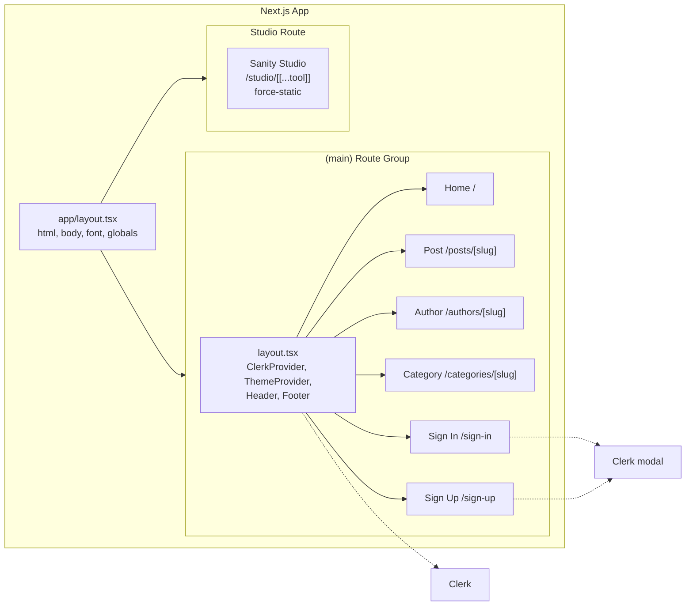
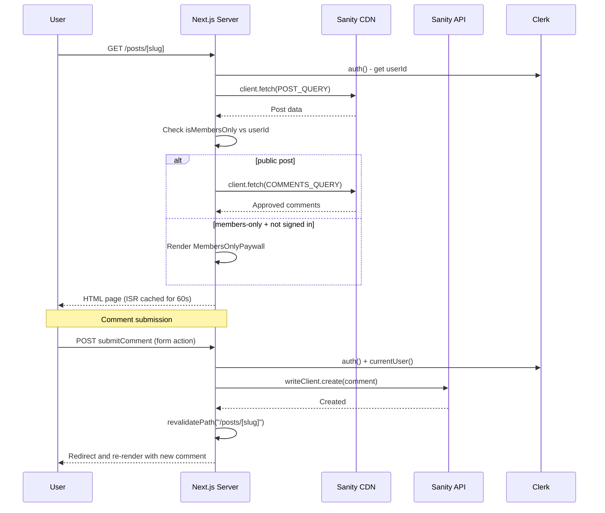
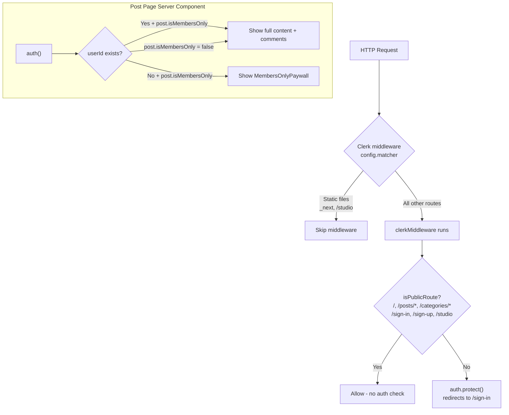
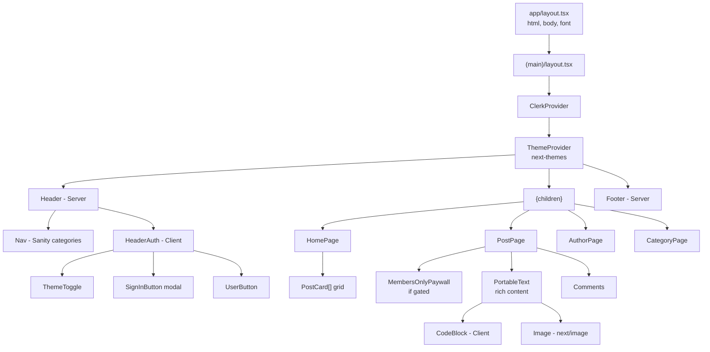
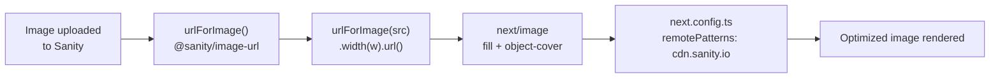
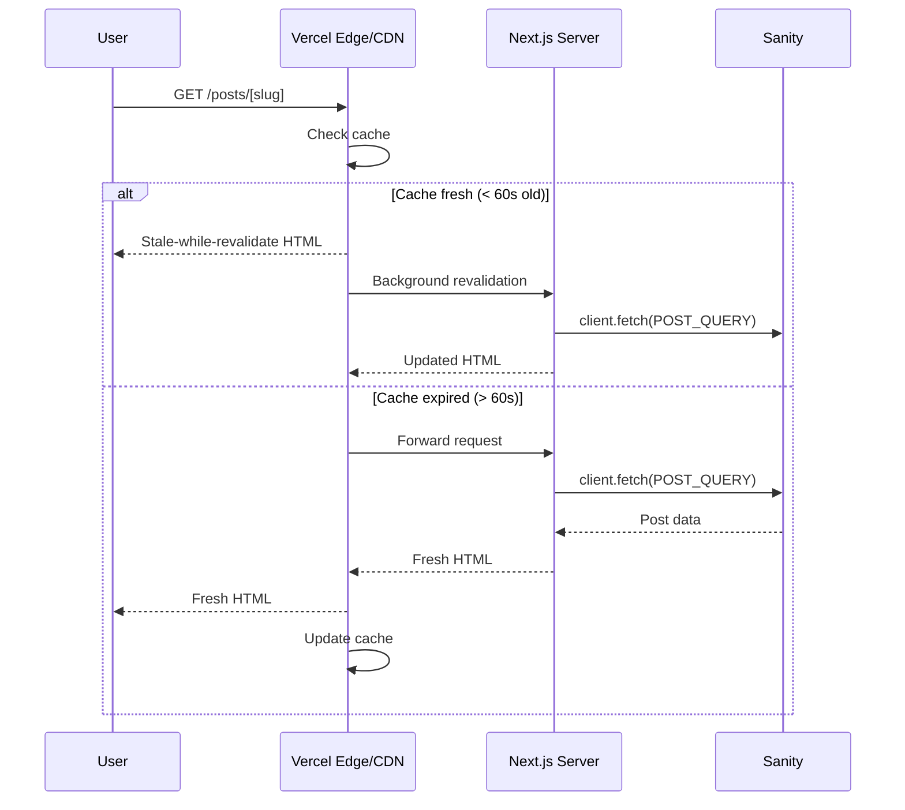

# Architecture

## Overview

GreyMatter Journal is a personal tech blog built with **Next.js 16** using the App Router, **React 19**, **Sanity CMS v6**, **Clerk** for authentication, **Tailwind v4** for styling, and **TypeScript** in strict mode.

```mermaid
graph TB
    User((User)) --> Next["Next.js 16 App"]
    Next --> Pages["Public blog routes\n(main) route group"]
    Next --> Studio["Sanity Studio\n/studio route"]
    Pages --> Root["Root Layout\nhtml, body, font"]
    Root --> MainGroup["(main) Layout\nClerkProvider, ThemeProvider"]
    MainGroup --> Header["Header\nSanity categories + auth"]
    MainGroup --> Content["Page content"]
    MainGroup --> Footer["Footer"]
    Content --> Sanity["Sanity CMS\nread client via CDN"]
    Content --> Clerk["Clerk auth"]
    Content --> Comments["Comments\nwrite client via token"]
```



## Directory Structure

```text
src/
├── app/
│   ├── (main)/                 # Route group: public blog
│   │   ├── layout.tsx          # (main) layout: ClerkProvider, ThemeProvider, Header, Footer
│   │   ├── page.tsx            # Homepage
│   │   ├── authors/[slug]/     # Author profile
│   │   ├── categories/[slug]/  # Category listing
│   │   ├── posts/[slug]/       # Post detail + OG image
│   │   ├── sign-in/            # Clerk sign-in
│   │   └── sign-up/            # Clerk sign-up
│   ├── layout.tsx              # Root layout: html, body, Inter font, globals.css
│   ├── studio/                 # Sanity Studio (separate layout)
│   ├── globals.css             # Tailwind v4
│   ├── sitemap.ts
│   └── robots.ts
├── actions/
│   └── comments.ts             # Server action
├── components/
│   ├── Header.tsx              # Server: dynamic category nav
│   ├── HeaderAuth.tsx          # Client: Clerk buttons + theme toggle
│   ├── Footer.tsx
│   ├── PostCard.tsx
│   ├── Comments.tsx            # Server: comment list + form
│   ├── CodeBlock.tsx           # Client: Prism syntax highlighting
│   ├── PortableTextComponents.tsx  # Sanity block content renderers
│   ├── MembersOnlyPaywall.tsx
│   ├── ThemeProvider.tsx
│   └── ThemeToggle.tsx
├── sanity/
│   ├── lib/
│   │   ├── client.ts           # Read client, CDN in production
│   │   ├── writeClient.ts      # Write client, token-based
│   │   ├── image.ts            # urlForImage helper
│   │   ├── queries.ts          # GROQ queries
│   │   └── types.ts            # TypeScript types
│   └── schemaTypes/            # Document schemas
└── proxy.ts                    # Clerk middleware
```

## Routing & Layouts

Layouts are split into two layers:

1. `app/layout.tsx` is the root layout. It provides the outer `<html>` and `<body>` wrapper, the font, and the global CSS import.
2. `app/(main)/layout.tsx` is the public route-group layout. It adds `ClerkProvider`, `ThemeProvider`, `Header`, `Footer`, and the main content container.

The `/studio` route has its own layout and stays separate from the public blog shell. It does not need Clerk and is exported as `force-static`.



## Data Flow

All content pages are server components that fetch data from Sanity at request time. ISR with `revalidate = 60` keeps pages cached for 60 seconds between regenerations.



## Auth Architecture

Auth middleware lives in `proxy.ts`, not `middleware.ts`. Public-facing blog routes are open, while any route not listed as public is protected.



## Sanity Schema

Five document types define the content model in the CMS.


## Component Tree



## Image Pipeline



## ISR Strategy



## Key Decisions

| Decision | Implementation |
|---|---|
| Framework | Next.js 16 App Router, React 19 |
| Styling | Tailwind v4 with `@import "tailwindcss"`, `@plugin "@tailwindcss/typography"`, class-based dark mode |
| CMS | Sanity v6 at `/studio`, queried via GROQ |
| Auth | Clerk v7; middleware in `proxy.ts`, server `auth()`, client `SignInButton` and `UserButton`, public blog routes |
| Rendering | ISR with `revalidate = 60` on content pages |
| Image handling | Sanity `@sanity/image-url` to `next/image` with `fill` and `remotePatterns` |
| Rich content | `@portabletext/react` with custom code block, image, and heading renderers |
| Comments | Server action with `auth()` check, writes via `writeClient` with token, auto-approved |
| Types | TypeScript strict mode, `@/*` alias mapped to `./src/*` |
| SEO | Dynamic `sitemap.ts`, `robots.ts`, `generateMetadata`, dynamic OG images via `next/og` |
