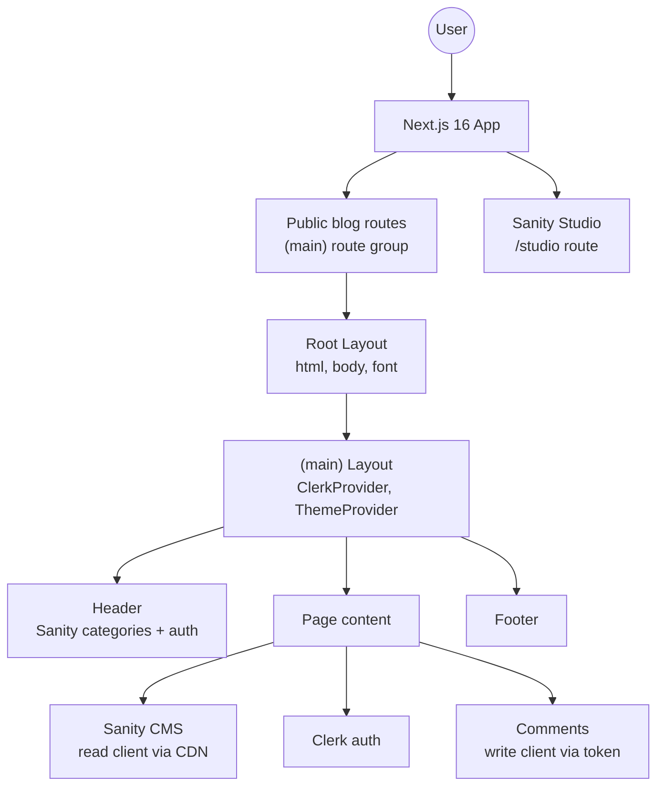
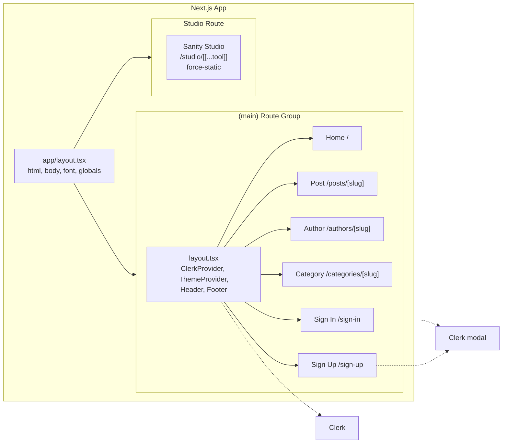
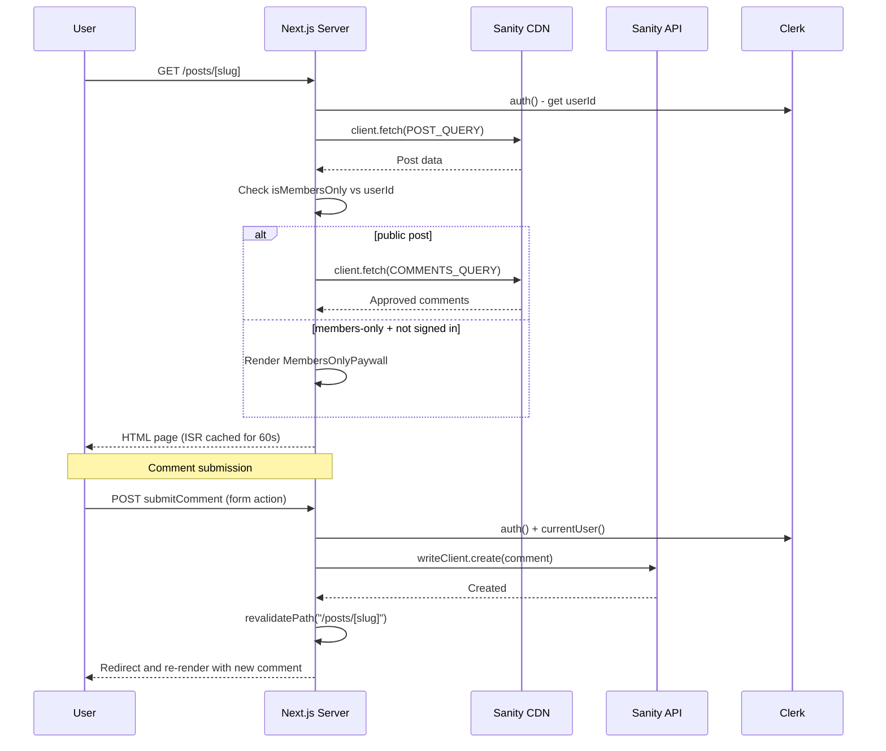
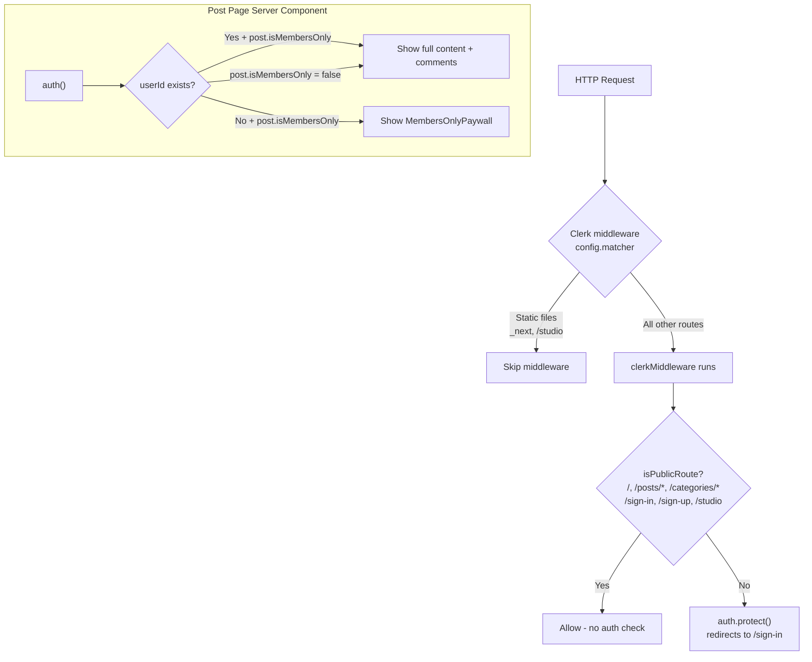
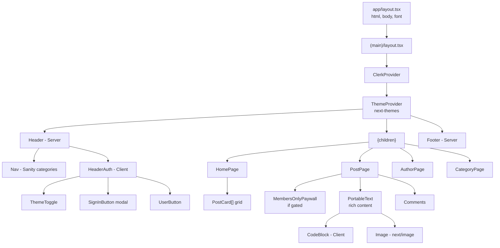
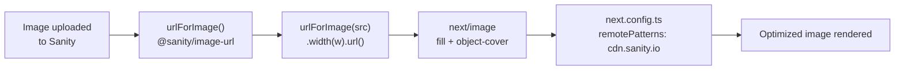
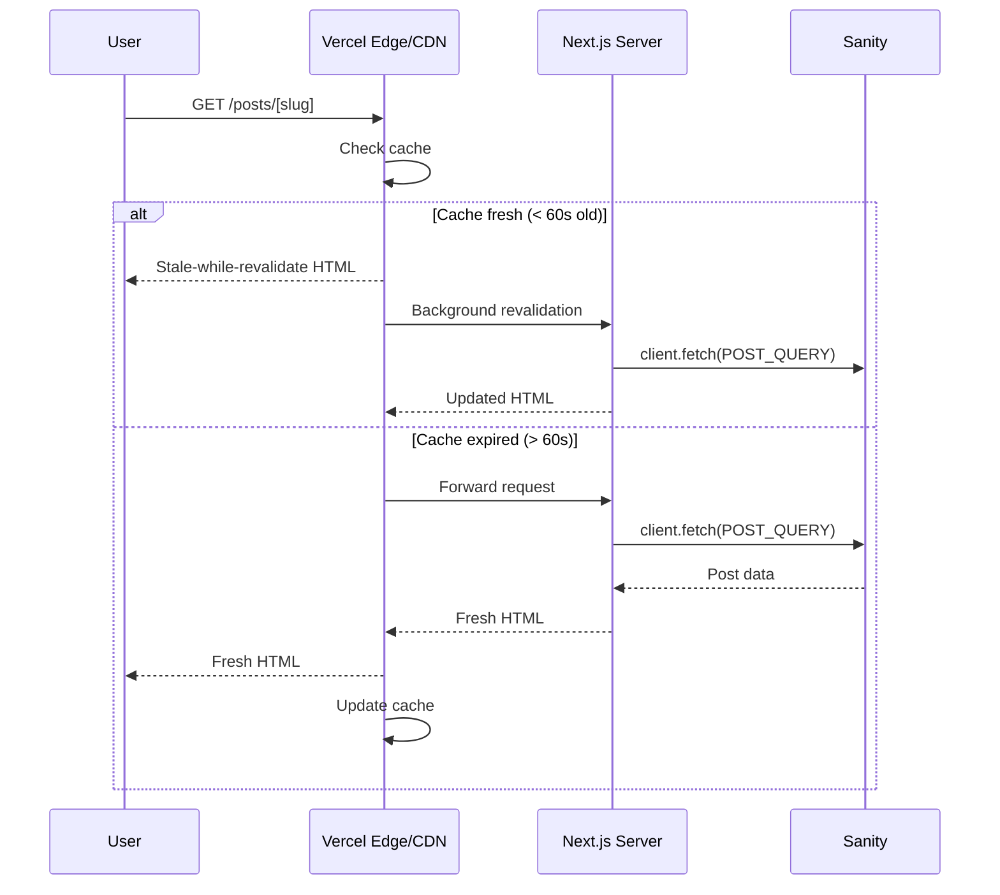

# Architecture

## Overview

GreyMatter Journal is a personal tech blog and content platform built with **Next.js 16** using the App Router, **React 19**, **Sanity CMS v6**, **Clerk** for authentication, **Tailwind v4** for styling, and **TypeScript** in strict mode. It is designed around a server-first rendering model, with Sanity powering content authoring and Next.js serving the public reading experience through cached server-rendered pages and incremental regeneration. [nextjs](https://nextjs.org/docs/app/guides/incremental-static-regeneration)

The architecture is intentionally split into two distinct modes: a public consumption layer for readers and a separate authoring layer for content management. The public site prioritizes performance, SEO, and access control, while the Sanity Studio remains a statically hosted backend workspace for editors and maintainers. [nextjs](https://nextjs.org/docs/app/guides/incremental-static-regeneration)

## System goals

The system is optimized for three core goals. First, it keeps the content model strongly typed end to end so Sanity documents, GROQ responses, and UI props remain aligned in TypeScript strict mode. Second, it keeps the public experience fast by leaning on server components, CDN-backed content reads, and ISR caching. Third, it keeps the authoring and runtime concerns separated so editorial workflows can evolve without coupling to the public blog shell.

This makes the codebase easier to maintain, easier to extend, and safer to change. It also creates a clean boundary between rendering, data access, authentication, and content editing.

## Technical stack

| Decision | Implementation |
|---|---|
| Framework | Next.js 16 App Router, React 19 |
| Styling | Tailwind v4 with `@import "tailwindcss"`, `@plugin "@tailwindcss/typography"`, class-based dark mode |
| CMS | Sanity v6 at `/studio`, queried via GROQ |
| Auth | Clerk v7; middleware in `proxy.ts`, server `auth()`, client `SignInButton` and `UserButton`, public blog routes |
| Rendering | ISR with `revalidate = 60` on content pages |
| Image handling | Sanity `@sanity/image-url` to `next/image` with `fill` and `remotePatterns` |
| Rich content | `@portabletext/react` with custom code block, image, and heading renderers |
| Comments | Server action with `auth()` check, writes via `writeClient` with token, auto-approved |
| Types | TypeScript strict mode, `@/*` alias mapped to `./src/*` |
| SEO | Dynamic `sitemap.ts`, `robots.ts`, `generateMetadata`, dynamic OG images via `next/og` |

## Routing and layout

The application uses two layout layers so that the root structure stays minimal while the public site shell can manage shared UI concerns. `app/layout.tsx` provides the outer `html` and `body` structure, global CSS, and font setup. `app/(main)/layout.tsx` wraps the public routes with `ClerkProvider`, `ThemeProvider`, `Header`, and `Footer`.

The `/studio` route is isolated from the public blog shell and uses its own layout. It is exported as `force-static`, which keeps the CMS interface separate from the dynamic blog runtime and avoids unnecessary auth coupling. [nextjs](https://nextjs.org/docs/app/guides/incremental-static-regeneration)

## Request and data flow

Public content pages are Server Components that read data from Sanity at request time. That keeps the data-fetching logic close to the render path and avoids shipping content loading work to the browser. ISR with `revalidate = 60` gives each page a short caching window, which is a good fit for blog content that changes occasionally but does not need real-time updates. [nextjs](https://nextjs.org/docs/app/guides/incremental-static-regeneration)

When a post page loads, the server checks the session with `auth()`, fetches the post data from Sanity, and decides whether the user can view the full content. If the post is members-only and the user is not signed in, the server renders a paywall state instead of the article body. If comments are enabled for the post, approved comments are fetched from Sanity and included in the rendered response.

## Authentication model

Authentication is handled with Clerk v7 and split across edge middleware and server-side authorization checks. The edge layer in `proxy.ts` is responsible for route-level protection, while Server Components use `auth()` to make content decisions during rendering. Public routes are explicitly allowed through, and protected routes redirect to sign-in when the session is missing.

This is a clean separation of concerns: the middleware decides whether a request may proceed, and the page-level server logic decides what the user is allowed to see. That keeps the blog public where it should be public while still supporting gated content and authenticated actions. [nextjs](https://nextjs.org/docs/app/guides/incremental-static-regeneration)

## Content model

The Sanity schema defines the application’s editorial model through five core document types: Post, Author, Category, Comment, and BlockContent. Posts are the central entity and connect to authors, categories, rich-body content, and comments. This makes it straightforward to build listing pages, detail pages, author archives, and category archives from the same underlying content graph.

Every query result should map to a matching TypeScript interface in `src/sanity/lib/types.ts`. That ensures the UI never relies on loosely shaped data and gives the codebase a reliable contract between CMS content and application rendering.

## Component architecture

The component tree follows a server-first pattern. Shared UI and data-fetching components stay on the server unless they genuinely need client-side interaction. That keeps the default render path simpler, reduces hydration cost, and makes the codebase easier to reason about.

Client components are used selectively for interactivity such as theme switching, Clerk buttons, and code highlighting. Everything else, including navigation rendering, article rendering, and comment composition, remains server-centric whenever possible.

## Image handling

Images are stored in Sanity and transformed through the `urlForImage()` helper from `@sanity/image-url`. That helper builds optimized image URLs, which are then passed into `next/image` for responsive rendering, layout stability, and performance. The Next.js image configuration allows the Sanity CDN domain through `remotePatterns`, so images can be optimized safely at runtime. [nextjs](https://nextjs.org/docs/app/guides/incremental-static-regeneration)

This pipeline keeps content authors free to upload media normally while the application handles responsive delivery, sizing, and rendering efficiency automatically.

## ISR and caching

The caching strategy is intentionally simple. Most content pages use ISR with a 60-second revalidation window, which gives the blog static-like speed while still allowing content updates to appear quickly.  For more targeted freshness, path-based and tag-based revalidation can be used after writes or CMS updates so the site does not need to wait for a full TTL cycle. [blog.curbanii](https://blog.curbanii.net/practical-caching-recipes-for-next-js-app-router/)

That means the site can remain fast under normal load, while comments, editorial changes, or content edits can still surface quickly when needed.

## Operational workflows

The read path and write path are deliberately different. Reads are optimized for cacheable server rendering and CDN-backed data retrieval. Writes are limited to server actions so the code can validate the user, enforce permissions, and keep secrets out of the client bundle.

Comment submission follows a secure write flow: the server checks the Clerk session, creates the comment through the Sanity write client, and then revalidates the relevant post route. That keeps the UI responsive while ensuring the visible page state reflects the latest approved data. [nextjs](https://nextjs.org/docs/app/guides/incremental-static-regeneration)

## Key decisions

| Decision | Implementation |
|---|---|
| Framework | Next.js 16 App Router, React 19. Note: `params` is async and must be awaited. |
| Styling | Tailwind v4 with `@import "tailwindcss"`, `@plugin "@tailwindcss/typography"`, class-based dark mode |
| CMS | Sanity v6 at `/studio` (`force-static`), queried via GROQ |
| Auth | Clerk v7; middleware in `proxy.ts`, server `auth()`, client modal-based auth UI |
| Rendering | ISR with `revalidate = 60` on content pages; use `revalidatePath` and `revalidateTag` for targeted updates |
| Image handling | `@sanity/image-url` to `next/image` with `fill` and `remotePatterns` |
| Rich content | `@portabletext/react` with custom code block, image, and heading renderers |
| Comments | Server action with Clerk validation, `writeClient`, token-based writes, auto-approved flow |
| Types | TypeScript strict mode, `@/*` alias mapped to `./src/*` |
| SEO | `sitemap.ts`, `robots.ts`, `generateMetadata`, dynamic OG images via `next/og` |

## Implementation principles

The codebase follows a server-first architecture, which means client-side React is used only where the user actually needs interactivity. That keeps the app easier to maintain and reduces unnecessary hydration work. The content boundary is strictly typed so Sanity documents, query results, and UI expectations stay aligned.

Security is enforced at the edge and again at the server action layer. `proxy.ts` is the main route gatekeeper, and `SANITY_API_WRITE_TOKEN` remains server-only inside mutation code paths. That combination makes it harder to accidentally expose privileged operations or weaken route protection when the app grows.

## Maintenance notes

When you add a new route, audit `proxy.ts` first to make sure the matcher and public-route list still make sense. When you add a new Sanity field or document type, update the query, the corresponding TypeScript types, and any Portable Text renderers together. When you add mutating behavior, keep it in server actions so auth checks, secret access, and cache invalidation stay centralized.

This is also the right place to document any future expansion, such as on-demand revalidation from Sanity webhooks, new content types, or new gated content workflows. Those changes should extend the existing structure rather than bypass it.

## Source alignment

The ISR, revalidation, and App Router caching guidance here aligns with the current Next.js documentation and recent caching/revalidation references. [blog.curbanii](https://blog.curbanii.net/practical-caching-recipes-for-next-js-app-router/)